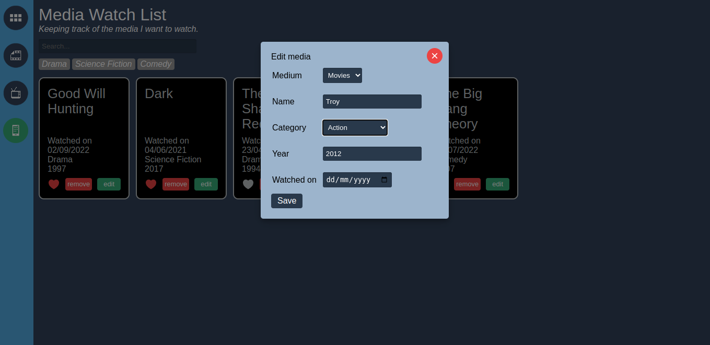

# MediaTrackerApp

**`MediaTrackerApp`** helps user to keep track of media items watched by user.

I have created this project to practice what I have learnt from `Angular Essential Training` a linkedIn learning course.

I have included some additional features.

## This project covers following angular topics

- Input, Output decorators
- Reactive forms
- Custom directives
- Custom pipes
- Custom modal from scratch
- Lazy loading
- Rxjs operators
- Search feature using observable
- HTTP calls

## How to start

1. To install the project dependencies run:

   `npm install`

2. To run the project run:

   `npm start`

## Project preview

